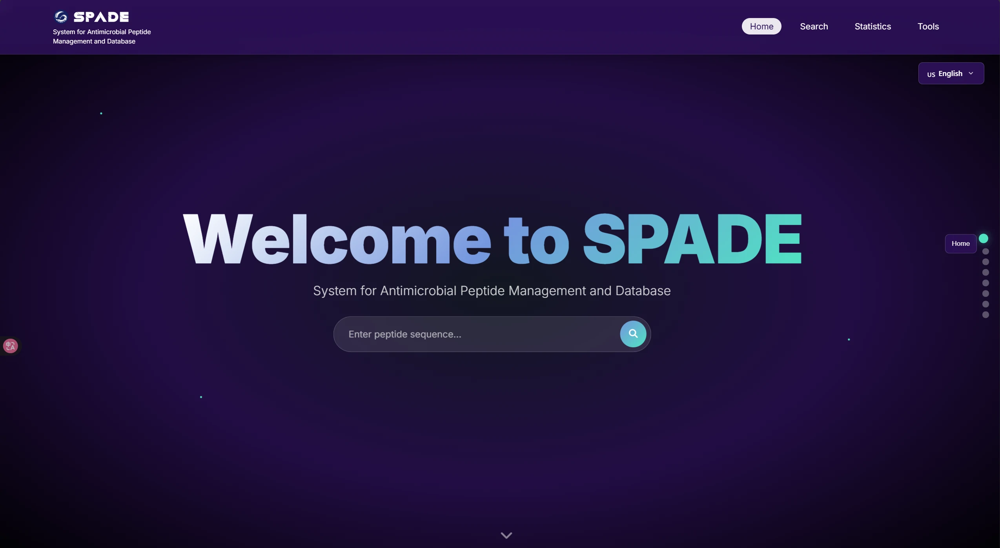
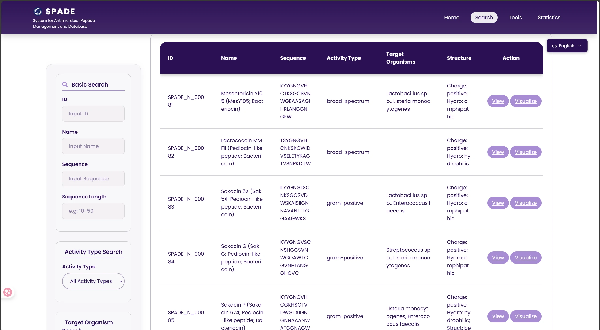
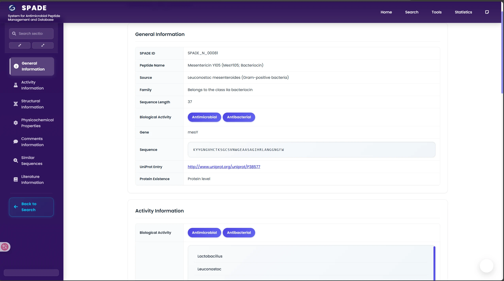
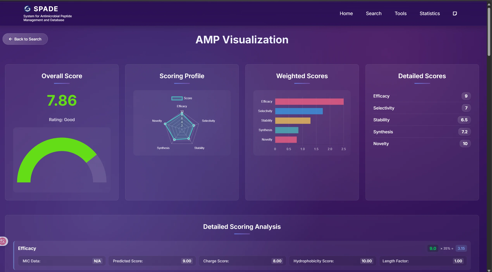
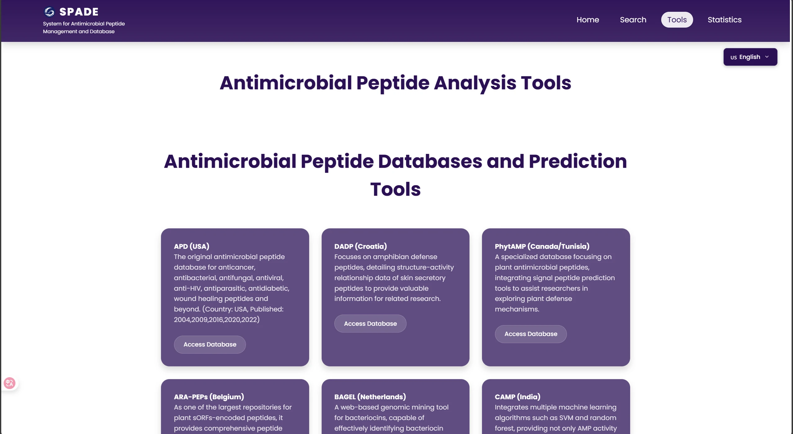
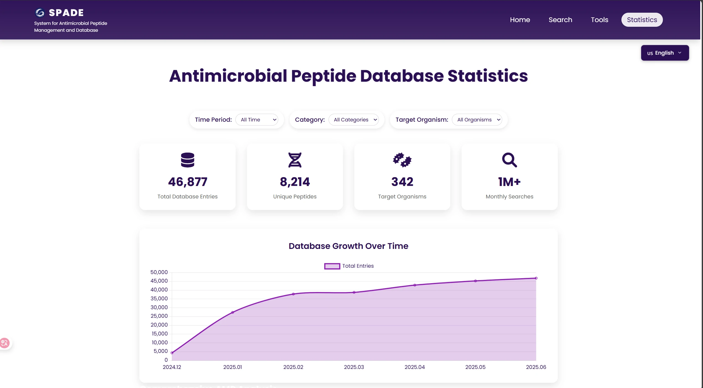
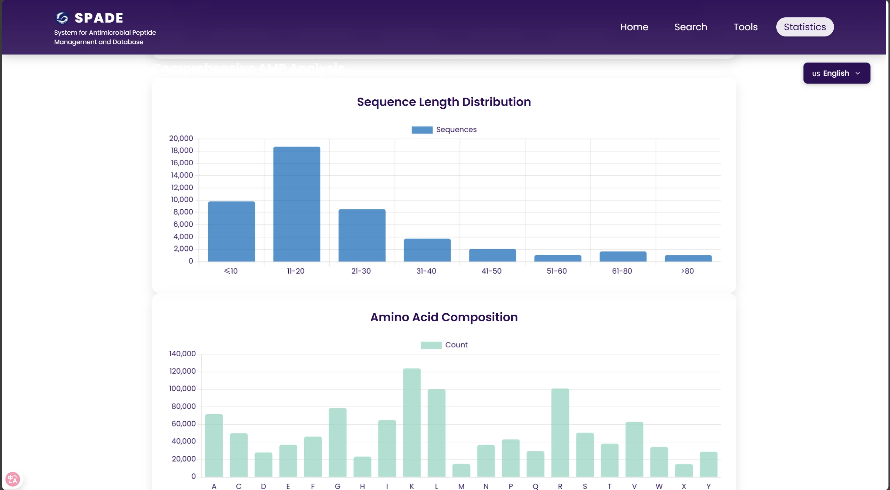
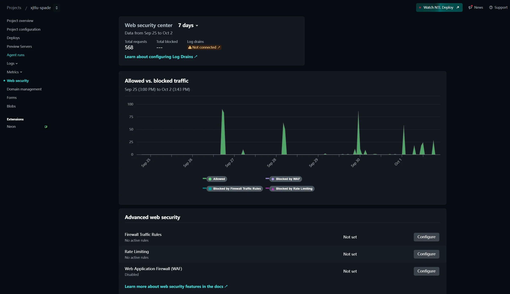
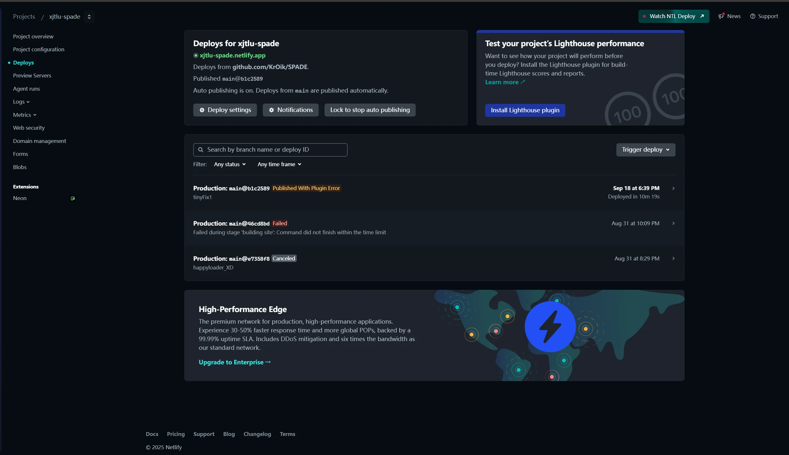

# SPADE: Smart Platform for Antimicrobial Peptide Discovery and Engineering

## Overview

SPADE (Smart Platform for Antimicrobial Peptide Discovery and Engineering) is an intelligent software tool designed to accelerate the discovery and development of antimicrobial peptides (AMPs). AMPs are promising alternatives to traditional antibiotics, but identifying and optimizing them is a complex and time-consuming process. SPADE addresses this challenge by providing a comprehensive, user-friendly platform that integrates a vast database of AMPs with a powerful predictive model.

Our platform is designed for researchers in bioinformatics, molecular biology, and drug discovery. It simplifies the process of screening and analyzing AMPs, enabling users to:

*   **Intelligently search** a curated database of over 46,000 AMPs using multi-dimensional criteria.
*   **Predict the properties** of novel peptide sequences, including their antimicrobial activity, toxicity, and stability.
*   **Gain insights** into the structure-function relationships of AMPs to guide rational design.

SPADE aims to lower the barrier to entry for AMP research, making it easier for scientists to find and engineer effective and safe antimicrobial candidates.

## Software

SPADE is a comprehensive software tool designed to streamline the discovery and engineering of antimicrobial peptides (AMPs). It provides a user-friendly platform that integrates a vast database of AMPs with a powerful predictive model, making it an essential tool for researchers in bioinformatics, molecular biology, and drug discovery. The software is designed to be accessible to a wide audience, with a clear and intuitive interface that guides users through the process of searching, analyzing, and predicting the properties of AMPs.

## How to Use

SPADE (Synthetic Biology and AI-driven Discovery Engine for Antimicrobial Peptides) is a comprehensive platform designed to accelerate the discovery and development of novel antimicrobial peptides. It integrates synthetic biology principles and artificial intelligence to provide a powerful and intuitive research tool.

Here’s a visual guide to its key features:

  <strong>1. Welcome Page & Dashboard</strong> 
  Start on the main page for an overview of the platform. The backend dashboard provides insights into how SPADE's extensive data is managed and organized, showcasing the database that powers the platform.
   
  

  <strong>2. Database Retrieval and Navigation</strong> 
  Use the <strong>Search</strong> page to query curated AMP entries. You can filter results by species, activity spectrum, sequence length, physicochemical properties, and more. From the results, view detailed information for each peptide and seamlessly navigate to related sequences using the quick link feature.
   
  
  

  <strong>3. Analysis and Visualization</strong> 
  The platform offers detail visualization. You can view peptide activity, assess toxicity, and analyze physicochemical properties.
   
  

  <strong>4. Tools for Antimicrobial Peptide Research</strong> 
  The SPADE platform includes a dedicated tools page that provides access to over 60 different tools for antimicrobial peptide research, including sequence analysis, structure prediction, and more.
   
  

  <strong>5. Platform Statistics and Monitoring</strong> 
  The statistics section provides batch analysis tools for length distribution, amino-acid frequency, and property histograms. SPADE also includes a dedicated access dashboard for monitoring platform usage and traffic.
   
  
  

  <strong>6. Platform Monitoring and Accessibility</strong> 
  Powerful backend supervision platform to ensure that the platform maintains accessibility and high performance for all users.
   
  
  

### Key Features at a Glance

-   **AMP Sequence Generation**: Generate new potential antimicrobial peptide sequences based on advanced AI models.
-   **Activity Prediction**: Evaluate the antimicrobial activity of input sequences against specific pathogens.
-   **Toxicity Assessment**: Predict the potential toxicity of peptide sequences to identify safe therapeutic candidates.
-   **Database Integration**: Access and compare findings with existing AMP databases and scientific literature.

## Contributing

We welcome contributions from the community to make SPADE even better! Whether you're a developer, a researcher, or a user, there are many ways to contribute:

- **Reporting Bugs**: If you find a bug, please open an issue on our GitHub repository at [https://github.com/KrOik/SPADE](https://github.com/KrOik/SPADE).
- **Suggesting Enhancements**: Have an idea for a new feature or an improvement to an existing one? We'd love to hear it.
- **Contributing Code**: We are open to pull requests. Please read our contribution guidelines before submitting.
- **Improving Documentation**: If you find any part of the documentation unclear or incomplete, feel free to suggest changes.
- **Sharing Data**: If you have curated AMP data that you would like to share, please get in touch with us.

Your contributions are valuable and help us advance the field of antimicrobial peptide research.

## Design

This section explains the key design choices, trade-offs, and architecture of the SPADE platform.

### Design Rationale

The development of SPADE was motivated by the limitations of traditional methods for discovering antimicrobial peptides (AMPs). These methods, such as wet-lab screening and traditional database searches, are often slow, resource-intensive, and have a low success rate. Existing databases, while valuable, are often fragmented, lack standardized data, and do not provide predictive capabilities.

SPADE was designed to overcome these limitations by creating an intelligent, integrated platform that combines a comprehensive database with a powerful predictive model. Our design philosophy is centered on three key principles:

1.  **Integration:** Combining a large-scale database with a multi-task predictive model to provide a one-stop solution for AMP research.
2.  **Intelligence:** Using machine learning to predict the properties of AMPs, enabling rational design and reducing the need for expensive and time-consuming experiments.
3.  **Accessibility:** Providing a user-friendly interface that makes the platform accessible to researchers from diverse backgrounds, regardless of their computational expertise.

### Software Architecture

The SPADE platform is built on a modern web-based architecture, consisting of a frontend, a backend, and a machine learning model.

*   **Frontend:** The frontend is a responsive web interface that provides an intuitive user experience. It is designed to be accessible on both desktop and mobile devices.
*   **Backend:** The backend is responsible for handling user requests, querying the database, and running the predictive model. It is built using a scalable architecture to handle high-concurrency access and computationally intensive tasks.
*   **Database:** The SPADE database is a comprehensive collection of over 46,000 AMPs, with detailed information on their sequences, activities, and properties.
*   **Predictive Model:** The platform integrates a multi-task machine learning model, AMP4multitask, which can predict the antimicrobial activity, toxicity, and stability of peptide sequences.

### Trade-offs and Compromises

During the development of the prototype, we made several design trade-offs to balance functionality, performance, and development speed. For example, in the initial version, we used a flattened data storage model for simplicity and rapid prototyping. However, we have designed a more advanced database architecture using PostgreSQL and Elasticsearch for future versions to improve search performance and scalability.

A known issue is that the user experience on mobile devices needs further optimization. The current interface is best suited for desktop browsers, and we plan to improve mobile responsiveness in future iterations.

---

## Detailed Documentation

This section contains the complete, detailed translation of the original design document.

### 1. Design Phase

#### 1.1 Design Basis

##### 1.1.1 Limitations of Traditional Screening Methods

The traditional methods for discovering antimicrobial peptides (AMPs) are like "finding a needle in a haystack." The process of isolating and screening AMPs from natural organisms is not only time-consuming and labor-intensive but also has a very low success rate. Researchers need to go through multiple steps, including sample collection, extraction, purification, and activity testing, which often takes months or even years. This inefficiency severely limits the speed of discovering new AMPs.

##### 1.1.2 Deficiencies of Existing Databases

Although there are many public databases of antimicrobial peptides, they have some common problems. First, the data is scattered across different databases, and the formats are not uniform, making it difficult for researchers to perform comprehensive queries and analyses. Second, these databases mainly provide experimentally verified data and lack predictive capabilities for unknown sequences. This means that researchers can only search for known AMPs and cannot evaluate the potential of new sequences. Finally, most databases are just static data repositories and do not provide interactive analysis tools, which limits their practical application value.

##### 1.1.3 Intelligent Platform Design Concept

To address the above challenges, we propose to build an intelligent platform called SPADE (Smart Platform for Antimicrobial Peptide Discovery and Engineering). The core idea of SPADE is to combine a large-scale, standardized antimicrobial peptide database with an advanced artificial intelligence prediction model. This platform will not only provide comprehensive data query functions but also predict the activity and properties of unknown peptide sequences, thereby helping researchers quickly screen out promising candidate molecules. Our goal is to make SPADE an indispensable tool for antimicrobial peptide research, accelerating the development of new antimicrobial drugs.

### 2. Expected Functions

#### 2.1 Intelligent Retrieval and Multi-dimensional Information Display

The SPADE platform will have a powerful intelligent retrieval function that allows users to search for desired antimicrobial peptides based on various criteria, such as sequence, source, target organism, and physicochemical properties. The search results will be displayed in a multi-dimensional manner, including not only the basic information of the peptide but also its activity data, structural information, and relevant literature, providing users with a comprehensive information overview.

#### 2.2 Predictive Modeling and Rational Design

The core function of the SPADE platform is its intelligent prediction module. By inputting an amino acid sequence, the user can obtain predictions of its antimicrobial activity, toxicity, stability, and other key properties. This function is based on our carefully trained machine learning model, which can help researchers evaluate the potential of new sequences and guide the rational design of antimicrobial peptides, thereby improving the success rate of research and development.

#### 2.3 Real-time Data Updates and Community Contributions

The SPADE platform will be a dynamic and evolving ecosystem. We will continuously collect the latest research results from public databases and scientific literature to ensure that the data on the platform is timely and accurate. In addition, we plan to introduce a community contribution mechanism that allows users to submit their own research data. After review, this data will be integrated into the database, making the platform a collaborative platform for the entire antimicrobial peptide research community.

### 3. Database Construction

#### 3.1 Data Collection and Collation

The construction of the SPADE database began with a large-scale data collection and collation effort. Our data sources include not only mainstream public databases in the industry (such as APD, DRAMP, DBAASP), but also a systematic review of a large number of scientific literature. Through this multi-channel approach, we have collected over 46,000 antimicrobial peptide sequences, covering a wide range of sources from bacteria to humans, as well as a large number of artificially synthesized peptides. For each sequence, we have also collected as much multi-dimensional information as possible, including its biological activity data (such as minimum inhibitory concentration), physicochemical properties (such as isoelectric point, hydrophobicity), and source information.

#### 3.2 Data Cleaning and Standardization

The collected raw data is often noisy and inconsistent. To ensure the quality of the database, we have implemented a strict data cleaning and standardization process. This includes removing duplicate sequences, correcting incorrect data entries, and unifying data formats and units. For example, we have standardized the units of minimum inhibitory concentration (MIC) to micromolar (μM) to facilitate comparison and analysis. Through this process, we have built a high-quality, standardized antimicrobial peptide database, which lays a solid foundation for subsequent data analysis and model training.

#### 3.3 Data Storage and Management Architecture

To efficiently store and manage this large-scale, multi-dimensional data, we have designed a flexible and scalable data storage and management architecture. The database is divided into two main parts: the core information database and the annotation information database. The core information database stores the basic information of each antimicrobial peptide, such as its sequence, length, and source. The annotation information database stores the multi-dimensional annotation information of the peptide, such as its biological activity, physicochemical properties, and structural information. This separated storage design not only improves the efficiency of data queries but also facilitates the expansion and maintenance of the database. In addition, we have optimized the table structure and indexes of the database to further improve the speed of data retrieval.

#### 3.4 Data Indexing Strategy and Architecture

To achieve fast and accurate data retrieval, we have designed a multi-level data indexing strategy and architecture. At the file level, we have created indexes for all key fields, such as sequence, source, and target organism. This allows the system to quickly locate the data that meets the user's query conditions. In addition, we have introduced a caching mechanism that stores frequently queried data in memory to further improve the response speed of the system. In the future, we plan to build a more complex multi-level indexing system, including sequence similarity indexes and keyword indexes, to support more advanced query functions.

### 4. Integration of Intelligent Prediction Module

#### 4.1 Introduction of the AMP4multitask Model

The core of the SPADE platform's intelligent prediction function is the AMP4multitask model. This model is a powerful multi-task machine learning model that we have carefully designed and trained. It can predict multiple key properties of an antimicrobial peptide simultaneously, including its antimicrobial activity, hemolytic toxicity, and in vivo half-life. The model is based on the Transformer architecture, which is a state-of-the-art deep learning model that has achieved great success in the field of natural language processing. We have adapted and optimized this model to make it suitable for processing amino acid sequences of antimicrobial peptides.

#### 4.2 Multi-task Prediction Capability of the Model

The core value of the AMP4multitask model lies in its excellent multi-task prediction capability, which enables the SPADE platform to provide users with a comprehensive and in-depth analysis of antimicrobial peptide properties. The model has been carefully designed and trained to handle four key prediction tasks simultaneously, covering multiple important aspects of antimicrobial peptides from activity to safety. Specifically, its multi-task prediction capability is reflected in the following aspects: 1) **AMP Classification:** The model can determine whether a given amino acid sequence belongs to an antimicrobial peptide, that is, whether it has broad-spectrum or specific antimicrobial activity. This is the basis for all subsequent functional predictions and can help researchers quickly screen out candidate molecules with potential application value. 2) **MIC Regression:** Minimum inhibitory concentration (MIC) is the gold standard for measuring the activity of antimicrobial peptides. The AMP4multitask model can predict the MIC value of an antimicrobial peptide against a specific pathogen, which provides a quantitative basis for evaluating the strength of its bactericidal effect. Accurate MIC prediction can help researchers prioritize candidate peptides with high activity and low dosage for subsequent experiments. 3) **Hemolysis Regression:** Hemolytic activity is an important indicator for evaluating the safety of antimicrobial peptides, as it reflects the toxicity of antimicrobial peptides to mammalian cells (especially red blood cells). The model can predict the hemolysis percentage of a peptide, helping researchers identify and exclude "toxic" peptides that may cause damage to human cells at an early stage, thereby improving the safety of drug development. 4) **Half-life Regression:** The stability of antimicrobial peptides in the body, that is, their half-life, is a key factor in determining whether they can become effective drugs. The model can predict the metabolic stability of antimicrobial peptides in the body, providing guidance for researchers to optimize their pharmacokinetic properties. By integrating the prediction results of these four tasks, the SPADE platform can generate a comprehensive "functional profile" for any unknown peptide sequence, thereby greatly assisting researchers in making rational decisions.

| Prediction Task | Task Description | Evaluation Metric | Performance |
| :--- | :--- | :--- | :--- |
| **AMP Classification** | Determine whether a given amino acid sequence is an antimicrobial peptide. | AUC (Area Under the ROC Curve), F1 Score | AUC: 0.9951, F1 Score: 0.9644 |
| **MIC Regression** | Predict the minimum inhibitory concentration of an antimicrobial peptide against a specific bacterium. | Pearson Correlation Coefficient | 0.7000 (based on 18,668 samples) |
| **Hemolytic Activity Regression** | Evaluate the hemolytic toxicity of an antimicrobial peptide to mammalian red blood cells. | Mean Absolute Error (MAE) | 0.1061 |
| **Half-life Regression** | Predict the metabolic half-life of an antimicrobial peptide in mammals. | Pearson Correlation Coefficient | 0.9851 |

*Table 1: Performance of the AMP4multitask model on various prediction tasks. These excellent performance indicators show that the model can not only identify potential antimicrobial peptides with extremely high accuracy but also reliably predict their key pharmacodynamic and pharmacokinetic parameters, greatly accelerating the discovery and optimization process of antimicrobial peptides.*

#### 4.3 Integration of the Model and Database

Seamlessly integrating advanced prediction models like AMP4multitask with the SPADE database is a key step in building the platform's intelligent functions. This integration is not a simple model deployment, but a systematic project involving data flow, calculation processes, and user interaction. First, at the data level, the diverse and structured data collected and integrated by the SPADE database provides a massive amount of high-quality labeled data for the training and optimization of the AMP4multitask model. The more than 46,000 antimicrobial peptide sequences included in the database, as well as their corresponding multi-dimensional information such as activity, toxicity, and physicochemical properties, constitute an ideal dataset for model training. By performing supervised learning on this data, the model can learn the complex mapping relationship between peptide sequences and their functions. Second, at the computational process level, the platform has established a set of efficient model inference services. When a user submits a prediction request on the front-end interface, the back-end service will receive the request, call the deployed AMP4multitask model for calculation, and return the model's prediction results (such as activity classification, MIC value, hemolysis, etc.) to the front end. To improve response speed and concurrent processing capabilities, the model is deployed on high-performance computing servers that support elastic computing (elastic allocation of computing power), and optimization techniques such as model quantization and batch processing are used to reduce performance overhead without reducing model quality. Finally, at the user interaction level, the platform will deeply integrate the model's prediction results with existing information in the database. When a user views the detailed information of an antimicrobial peptide, the platform will not only display its known experimental data but also the model's prediction of its properties. This dual information display mode of "experimental data + model prediction" provides users with a more comprehensive perspective. For example, for a newly discovered antimicrobial peptide, even if its experimental data is incomplete, users can refer to the model's prediction results to initially evaluate its application potential. Through this deep integration, the SPADE platform has successfully transformed a static database into a dynamic, intelligent analysis system, rather than a simple data integration platform.

### 5. Platform Architecture Design and Development

#### 5.1 Frontend Development

The frontend development of the SPADE platform is dedicated to providing users with an intuitive, friendly, and powerful interactive interface. The frontend adopts a modern web development technology stack to ensure the interface's aesthetics, response speed, and cross-platform compatibility. In terms of design philosophy, the frontend team follows the principle of "user-centered, intuitive operation," presenting complex backend functions to users in a simple and clear manner. The interface layout is clear, mainly divided into a retrieval area, a results display area, and a detailed information area. In the retrieval area, users can input query conditions in various ways, including simple sequence input and advanced filtering based on multi-dimensional conditions (such as activity type, target organism, physicochemical property range, etc.). The results display area clearly lists the antimicrobial peptides that meet the retrieval conditions in the form of tables or cards, and displays key information summaries. Users can click on any result to view the comprehensive information of the antimicrobial peptide in the detailed information area, including its sequence, all known experimental data, and relevant literature links. To enhance the user experience, the frontend also implements many interactive functions, such as one-click sequence copying, sorting and distribution charts of sequence information, and visual charts of related scoring information. In addition, considering the popularity of mobile devices, the frontend adopts a responsive design that can automatically adapt to different screen sizes, ensuring that users can have a good browsing and operating experience on mobile phones or tablets. Through careful frontend development, the SPADE platform has successfully packaged powerful backend functions into an easy-to-use interface, lowering the barrier to entry and making it easy for researchers from different backgrounds to get started.

#### 5.2 Backend Development

The backend development of the SPADE platform is the core of the stable and efficient operation of the entire system. It is responsible for processing requests from the frontend, interacting with the database and models, and returning the results to the frontend. The backend adopts a high-performance, scalable architecture design to cope with high-concurrency user access and complex computing tasks. In terms of technology selection, the backend uses Python and Node.js, two mainstream backend development languages, and combines corresponding web frameworks to quickly build RESTful APIs. These APIs define the communication protocol between the frontend and the backend, allowing the frontend and backend to be developed and deployed independently, improving development efficiency.

#### 5.3 Backend Architecture and Data Management Strategy

The backend architecture of the SPADE platform aims to build a functionally complete and logically clear service system to support its diverse retrieval and prediction functions. The current version, as a Proof-of-Concept, adopts a streamlined and efficient implementation plan, and a clear future optimization path has been planned to ensure its long-term technical foresight and service reliability.

The backend core consists of three key modules. The **Data Query Module** is responsible for parsing frontend requests, converting complex retrieval conditions into executable data acquisition operations. To meet the agility requirements of the prototype development stage and ensure broad data accessibility, the current version hosts the SPADE dataset on a public version control platform (such as GitHub), and this module is responsible for efficient interaction with it to obtain data. The **Model Inference Module** is responsible for calling the AMP4multitask multi-task machine learning model deployed on the backend when the user initiates a property prediction request. This module uses mechanisms such as asynchronous processing and task queues to effectively avoid request blocking caused by computationally intensive tasks, ensuring the fluency of user interaction. The **Data Processing and Integration Module** is responsible for collecting and formatting the final output. It integrates the raw results obtained from the data source with the model prediction results and encapsulates them in a JSON format that is easy for the frontend to parse and return. In addition, the backend also implements basic service assurance functions to provide necessary support for the stable operation of the platform.

In terms of data management strategy, the current prototype stage adopts a flattened data storage and access model. This solution effectively simplifies the deployment process in the early stages of the project, reduces development complexity, and ensures data transparency and accessibility. We are clearly aware that to achieve millisecond-level multi-dimensional retrieval and complex associated queries, using a professional database management system is the inevitable direction for future development. To this end, we have completed a detailed **high-performance database architecture design**. This design solution adopts a hybrid architecture combining a relational database (PostgreSQL) and a dedicated search engine (Elasticsearch), aiming to balance the transactional consistency of structured data with the rapid retrieval capabilities of unstructured data. The architecture plans to carefully normalize the core data tables and create efficient indexes for key fields. At the same time, it will use a vector search engine to handle complex queries such as sequence similarity comparison. This design lays a solid foundation for the platform's future performance leap and scalability.

With the current robust backend service implementation and forward-looking data architecture planning, the SPADE platform not only reliably achieves all preset functions in the prototype stage but also demonstrates its excellent sustainable evolution capabilities.

### 6. Test Phase: Functional Verification and Performance Evaluation

This study uses a combination of functional verification and usability evaluation to systematically test the SPADE platform. Given that the platform is in its initial release stage, the core purpose of the testing is to verify the feasibility and reliability of its core functions and to lay a methodological foundation for subsequent large-scale performance benchmark testing.

#### 6.1 Test Method

##### 6.1.1 Functional Verification Test

To ensure that all functions of the SPADE platform work as designed, we adopted an internal functional verification test plan. First, a standardized test sequence set was carefully constructed. This set includes known antimicrobial peptides with clear activity selected from public databases (such as APD3, DRAMP) (e.g., Magainin 2, LL-37), non-antimicrobial peptide sequences as negative controls, and synthetic sequences with specific physicochemical properties. Subsequently, this test sequence set was input one by one into the various functional modules of the SPADE platform (including multi-dimensional retrieval, activity prediction, physicochemical property calculation, etc.) to systematically verify its output integrity, logical correctness, and system stability. The specific test process includes: checking whether the system returns correctly formatted results; verifying whether the retrieval results of known positive sequences contain themselves or highly homologous sequences, and whether the prediction results are consistent with known literature reports; confirming whether negative control sequences obtain low probability prediction values; and evaluating the stable performance of the system under continuous requests. This test aims to fully guarantee the technical reliability of the platform as an analysis tool.

##### 6.1.2 Usability Evaluation and Future User Research Framework

In terms of usability evaluation, we conducted a small-scale preliminary internal evaluation and formulated a detailed future user research framework. The preliminary evaluation invited 5 internal members with a background in molecular biology or bioinformatics to collect qualitative feedback on interface intuitiveness, operating procedures, and documentation clarity by completing typical tasks such as "finding frog-derived antimicrobial peptides active against E. coli" or "evaluating the hemolytic potential of a given sequence." On this basis, we constructed a rigorous future evaluation plan: we plan to use the existing test sequence set to run SPADE and the traditional BLASTp tool in parallel under the same hardware environment, quantitatively compare key indicators such as retrieval time and memory usage, and conduct statistical analysis; at the same time, we plan to recruit 30-50 researchers from across disciplines, use a task model to quantify task completion time, success rate, and error rate, and collect user satisfaction data through the System Usability Scale (SUS) questionnaire. This complete plan has passed ethical review.

#### 6.2 Key Findings and Future Prospects

The internal functional verification test results show that all core modules of the SPADE platform are operating normally as designed. The system can accurately receive query input, process and return multi-dimensional retrieval results, and the return results of the test sequences are highly consistent with theoretical expectations, fully demonstrating the technical correctness and operational reliability of the platform. Qualitative feedback from the preliminary internal evaluation shows that trial users highly appreciate the platform's integrated functions and multi-dimensional retrieval capabilities, believing that it significantly simplifies the workflow and is more inspiring.

Based on the platform's advanced pre-built index structure and integrated design architecture, we expect it to have the following significant advantages: in terms of retrieval efficiency, the SPADE platform is expected to significantly reduce computation time compared to traditional sequence-by-sequence alignment tools (such as BLAST), especially in large-scale database query scenarios, achieving significant performance improvements; in terms of user efficiency, the platform can potentially greatly reduce the time cost for researchers to acquire and process data by integrating scattered analysis functions, allowing them to focus more on scientific discovery and result interpretation. In summary, this chapter establishes the testing strategy of the SPADE platform and confirms its basic functional effectiveness. A comprehensive comparative study aimed at objectively quantifying its performance efficiency and user benefits has become the core focus of the next step, and the relevant results will be reported in detail in subsequent work.

#### 6.3 Deviation from Expectations

##### 6.3.1 Mobile User Experience

Although the SPADE platform performs well on the desktop, the test also revealed a problem that deviates from expectations: the user experience on mobile devices (mobile phones, tablets) needs to be further optimized. With the popularization of mobile devices in scientific research, more and more users hope to be able to access and use the SPADE platform anytime, anywhere. However, the current version of the platform seems to be mainly optimized for desktop browsers, and there are some adaptation problems on mobile devices. The specific manifestations are:

1.  **Interface Layout Issues:** On small-screen mobile devices, the platform's interface elements (such as tables, charts, and input boxes) may not be fully displayed, requiring users to frequently zoom and drag the screen to view and operate, resulting in a poor experience.

2.  **Response Speed Issues:** Although the platform's core retrieval speed is fast, on mobile devices, due to limitations in the network environment and device performance, the page loading and rendering speed may be slow, affecting the overall fluency.

3.  **Interaction Design Issues:** Some interactive functions realized by mouse hover or right-click menus on the desktop lack corresponding touch operation methods on mobile devices, resulting in some functions being unusable or inconvenient to operate.

These problems indicate that there is still room for improvement in the responsive design of the SPADE platform. To improve the mobile user experience, our technical team will redesign and adjust the interface layout in the next round of optimization, optimize the code to improve page loading speed, and improve the interaction methods to make them more in line with the habits of touch operations.

We believe that through dedicated mobile optimization, the SPADE platform will be able to better meet the needs of users in different scenarios and further expand its user base.

### 7. Learn Phase: Result Analysis and Optimization Direction

#### 7.1 Problem Analysis

##### 7.1.1 Insufficient Data Coverage under Extreme Environmental Conditions

Through in-depth analysis of platform test data and user feedback, the research team identified a key limitation of the current SPADE database: a significant gap in the coverage of antimicrobial peptide activity data under extreme environmental conditions. The biological activity of antimicrobial peptides is not static, but highly dependent on the physicochemical environment in which they are located, such as pH, temperature, ionic strength, etc. For example, some antimicrobial peptides have enhanced activity in acidic environments, but are inactivated in neutral or alkaline environments; others may remain stable and active at high temperatures. However, the vast majority of activity data currently included in the database is measured under standard laboratory conditions (such as neutral pH, 37°C). For activity data under extreme pH (such as strong acid, strong alkali), high temperature, high salt and other conditions, the number of entries is very limited, and the representativeness and consistency of the data are also problematic. This lack of data coverage directly leads to a significant reduction in the reliability of the SPADE platform and its integrated prediction models in these special application scenarios. When users need to find antimicrobial peptides suitable for specific industrial environments (such as fermentation processes, food processing) or physiological environments (such as gastric acid, skin), the platform cannot provide sufficient and reliable data support. Therefore, systematically and plannedly supplementing and integrating high-quality antimicrobial peptide activity data verified by experiments under extreme environmental conditions is a top priority for improving the database and enhancing the application value of the platform.

##### 7.1.2 Serious Lack of Specially Modified Sequences and Structural Information

Another key problem identified is the insufficient inclusion of specially chemically modified antimicrobial peptide sequences in the database, and the general lack of detailed corresponding structural information. In nature and in artificial design, many antimicrobial peptides undergo post-translational modifications (PTMs), such as glycosylation, lipidation, disulfide bond formation, C-terminal amidation, etc. These modifications play a crucial role in the stability, biological activity, targeting, and resistance to protease degradation of antimicrobial peptides. For example, lipidation can enhance the interaction of antimicrobial peptides with cell membranes, thereby increasing their antimicrobial activity. However, when existing core data sources include these specially modified peptides, they often only provide their amino acid sequences, while ignoring the specific type, location, and chemical structure of the modifications. This leads to incomplete information in the database, which greatly limits researchers' understanding and application of this important class of antimicrobial peptides. In addition, even if the sequence information is included, the corresponding three-dimensional structural information (especially the precise structure including the modification group) is seriously lacking. Structure is the basis for understanding function, and the lack of structural information makes it impossible for researchers to deeply study how these modifications affect the function of antimicrobial peptides through computational simulation and other means. Therefore, expanding the dataset containing rich and verified specially modified peptides and integrating their precise chemical structure information and biological activity data is a core task to enhance the utility of the SPADE platform in supporting cutting-edge antimicrobial peptide research.

#### 7.2 Next Round of Optimization Directions

##### 7.2.1 Data Expansion

Based on the above problem analysis, the primary direction for the next round of optimization of the SPADE platform is large-scale, targeted data expansion. To address the problem of "insufficient data coverage under extreme environmental conditions," the team will launch a systematic data collection plan, focusing on supplementing antimicrobial peptide activity data measured under non-standard conditions such as extreme pH (strong acid, strong alkali), high temperature, high salt, and high organic solvent concentration. This work will be carried out through multiple channels, including systematically retrieving and organizing published scientific literature, establishing cooperation with laboratories in related fields, and obtaining relevant information from professional biological activity databases through automated data collection tools. The collected data will undergo strict quality control and standardization before being integrated into the SPADE database. To improve the model's prediction ability under these special conditions, the team will also pay special attention to increasing the proportion of extreme condition samples in the training data, and use data augmentation techniques to balance the sample distribution under different conditions, so that the machine learning model can better learn and generalize to these special scenarios. To address the problem of "serious lack of specially modified sequences and structural information," the focus of data expansion will be on collecting antimicrobial peptide data containing detailed chemical modification information. The team will be committed to obtaining experimentally verified peptide sequences containing modification sites, modification types, and precise chemical structures. At the same time, the platform will actively integrate the three-dimensional structural information of modified peptides obtained from protein structure databases (such as PDB) or through computational prediction (such as AlphaFold), to provide users with a complete view from sequence to structure to function.

##### 7.2.2 Algorithm Optimization

At the algorithm level, the optimization direction of the SPADE platform will focus on improving the model's ability to recognize and predict complex biological sequences, especially for the challenges of "specially modified sequences" and "extreme environmental conditions." First, to improve the model's ability to recognize specially modified sequences, the team will explore more advanced sequence encoding methods and model architectures. For example, Graph Neural Networks (GNNs) that can explicitly handle modification information can be introduced, treating the peptide sequence and its modifications as a graph structure to better capture the interaction between modifications and the sequence. Alternatively, a dedicated modification information embedding layer can be added to the existing Transformer model to allow the model to learn the impact of different modifications on sequence features. Second, to improve the prediction accuracy of the model under extreme environmental conditions, the team will explore technologies such as Domain Adaptation or Transfer Learning. By fine-tuning the model with a small amount of extreme condition data on the basis of a large amount of standard condition data, the model can better adapt to the new data distribution, thereby improving its generalization ability under extreme conditions. In addition, the team will continue to pay attention to and introduce the latest research results from the academic community, such as more powerful protein language models, more efficient attention mechanisms, etc., and continuously iterate and upgrade the prediction models integrated into the platform to ensure that the SPADE platform always maintains a leading position in technology.

##### 7.2.3 User Experience

To further improve user satisfaction, the next round of optimization of the SPADE platform will focus on improving the user experience (UX), especially for the mobile experience problems exposed during the testing phase. The team will invest dedicated resources to comprehensively redesign and optimize the platform's mobile interface. This includes adopting a layout more suitable for small screens, increasing the size of touch buttons, more reasonable element design, optimizing font size and line spacing to improve readability, and simplifying the navigation menu to make it more in line with the operating habits of mobile users. In terms of performance, the team will deeply optimize the front-end code, for example, by using technologies such as code splitting, lazy loading, image compression, and CDN external link loading to reduce the initial loading time of the page and the amount of core data transmission, thereby improving the response speed and fluency of the platform in a mobile network environment. In addition, the team will also improve the interaction methods on the mobile end, and design corresponding touch operation alternatives for functions that rely on mouse hover or right-click menus on the desktop, to ensure that all core functions can be used conveniently on the mobile end. Through these systematic improvements, the SPADE platform aims to provide mobile users with an equally outstanding or even better user experience as the desktop end, thereby meeting the needs of modern scientific researchers for data query and analysis anytime, anywhere.

##### 7.2.4 Functional Expansion

To meet the deeper research needs of users and further enhance the application value of the platform, the SPADE platform plans to carry out a series of functional expansions in the future. One important direction is the integration of a **drug resistance prediction module**. With the increasing severity of antibiotic resistance, predicting whether an antimicrobial peptide will induce bacterial resistance has become crucial. The team plans to develop a machine learning-based drug resistance prediction module that predicts the potential drug resistance risk of a specific antimicrobial peptide to a specific bacterial strain by analyzing the mechanism of action of the antimicrobial peptide, the genomic information of the bacteria, and relevant experimental data. This will provide a more comprehensive safety assessment for the clinical application of antimicrobial peptides and help researchers select candidate drugs that are less likely to develop resistance. Another expansion direction is to add a **peptide design function**. On the basis of the existing prediction functions, the platform will further develop AI-based peptide design tools. Users can design brand-new antimicrobial peptide sequences with specific properties from scratch according to desired functions (such as broad-spectrum antibacterial, low toxicity, high stability) and structural features, using the platform's generative models (such as Generative Adversarial Networks (GANs) or Variational Autoencoders (VAEs)). In addition, the platform also plans to build an **antimicrobial peptide knowledge graph**, which will link entities such as antimicrobial peptides, genes, proteins, pathogens, and diseases in the database to form a huge semantic network. This will enable users to conduct deeper correlation analysis, for example, to explore the relationship between specific gene families and antimicrobial peptide activity, or to discover potential antimicrobial peptide targets for specific diseases, thereby opening up new avenues for the mechanistic research and drug development of antimicrobial peptides.

### 7.3 Platform Value

#### 7.3.1 Academic Value

The successful construction and application of the SPADE platform has brought significant academic value to the field of antimicrobial peptide research. First, by integrating and standardizing large-scale, multi-dimensional antimicrobial peptide data, it provides the academic community with a high-quality, trustworthy public data resource. This breaks down the previous barriers of scattered data and inconsistent formats, greatly facilitating researchers in data mining, comparative analysis, and model training, thereby promoting the data-driven research paradigm of the entire field. Second, the advanced machine learning models integrated into the platform, especially the AMP4multitask multi-task learning model, provide powerful computational tools for the functional prediction and rational design of antimicrobial peptides. This not only improves the discovery efficiency of new antimicrobial peptides but also provides new perspectives and methods for in-depth understanding of the structure-function relationship of antimicrobial peptides. As a successful bioinformatics application example, the SPADE platform demonstrates how to combine big data and artificial intelligence technology to solve complex problems in the fields of synthetic biology and drug discovery, providing valuable experience and inspiration for the development of related disciplines. Finally, the open-source and open nature of the platform promotes communication and cooperation among global researchers, accelerates the dissemination and sharing of scientific knowledge, and helps to form a collaborative and innovative research ecosystem.

#### 7.3.2 Application Prospects

With its powerful data integration and intelligent prediction capabilities, the SPADE platform shows broad prospects in multiple application fields. In the field of **pharmaceutical research and development**, the platform can be used to efficiently screen and design new antimicrobial peptide drugs, especially for the treatment of drug-resistant bacterial infections. By predicting the activity, toxicity, and pharmacokinetic properties of antimicrobial peptides, researchers can quickly lock in the most promising candidate molecules, thereby shortening the R&D cycle and reducing R&D costs. In the field of **food preservation**, the platform can help screen safe and efficient natural antimicrobial peptides as alternatives to chemical preservatives to extend the shelf life of food and meet consumer demand for healthy and natural food. In **agricultural applications**, the platform can be used to discover and design antimicrobial peptides that can improve crop disease resistance, or to develop new veterinary antimicrobial agents to reduce the use of traditional antibiotics in agriculture and ensure food safety and the ecological environment. In addition, in the field of **environmental protection**, the platform is also expected to be used to screen antimicrobial peptides that can degrade environmental pollutants or inhibit the growth of harmful microorganisms, providing new biotechnology solutions for environmental governance. With the continuous iteration and optimization of the platform, its application range will continue to expand, and it is expected to play an important role in more fields, contributing to solving major health and environmental challenges facing humanity.

### 7.4 Conclusion

The SPADE platform, as an intelligent platform for antimicrobial peptide research, provides powerful tools for antimicrobial peptide research by integrating a large-scale antimicrobial peptide database and advanced machine learning models. The platform performs well in terms of retrieval efficiency and prediction accuracy, and has been highly praised by users.

Although the platform performs well, there is still room for improvement in prediction under extreme conditions, recognition of specially modified sequences, and mobile user experience. Through continuous optimization and iteration, the platform will become an important infrastructure in the field of antimicrobial peptide research, providing strong support for the research and application of antimicrobial peptides.

With the increasingly serious problem of antibiotic resistance, the research value of antimicrobial peptides as a new type of antimicrobial agent is becoming increasingly prominent. The development and application of the SPADE platform will provide new ideas and methods for antimicrobial peptide research, promote the development of antimicrobial peptide research, and provide new possibilities for solving the problem of antibiotic resistance.

Rrefenrence : 
[1] Antimicrobial Peptide Database - DBAASP. https://dbaasp.org/home.

[2] TG-CDDPM: text-guided antimicrobial peptides generation based on conditional denoising diffusion probabilistic model. Briefings in Bioinformatics, 2024.

[3] Review on antimicrobial peptides databases and the computational tools. Database, Oxford Academic, 2024.

[4] AmPEP: Sequence-based prediction of antimicrobial peptides using distribution patterns of amino acid properties and random forest. https://repository.um.edu.mo/handle/10692/932.

[5] Antimicrobial Peptide Database. https://aps.unmc.edu/.

[6] A review on antimicrobial peptides databases and the computational tools. https://academic.oup.com/database/article-abstract/doi/10.1093/database/baac011/6550847.

[7] The antimicrobial peptide database is 20 years old: recent developments and future directions. https://onlinelibrary.wiley.com/doi/abs/10.1002/pro.4778.

[8] Improving the Annotation of the Venom Gland Transcriptome of Pamphobeteus verdolaga, Prospecting Novel Bioactive Peptides. https://www.mdpi.com/2072-6651/14/6/408.

[9] A Foundation Model Identifies Broad-Spectrum Antimicrobial Peptides against Drug-Resistant Bacterial Infection. Nature Communications, 2024.

[10] 西交利物浦大学学生团队连续十年参赛. https://www.163.com/dy/article/JGQBE2JE0534B975.html.

[11] 西浦学子获国际遗传工程机器大赛金牌. https://news.sina.com.cn/c/2017-11-28/doc-ifypapmz5823563.shtml.

[12] 学子 西浦学子首次斩获国际遗传工程机器大赛金奖. https://www.sohu.com/a/208610779_270298.

[13] 2025科普专栏丨SYPHU-China 抗微生物肽:来自自然的"微生物克星". https://new.qq.com/rain/a/20250724A028CC00.

[14] 抗菌肽的来源、作用机制及临床应用研究进展. https://www.hanspub.org/journal/PaperInformation.aspx?paperID=37249&btwaf=20049259.

[15] 中国iGEMer首度集结苏州!西交利物浦大学举办第十一届CCiC大会. https://finance.sina.com.cn/jjxw/2024-07-13/doc-inccwzps7419471.shtml.

