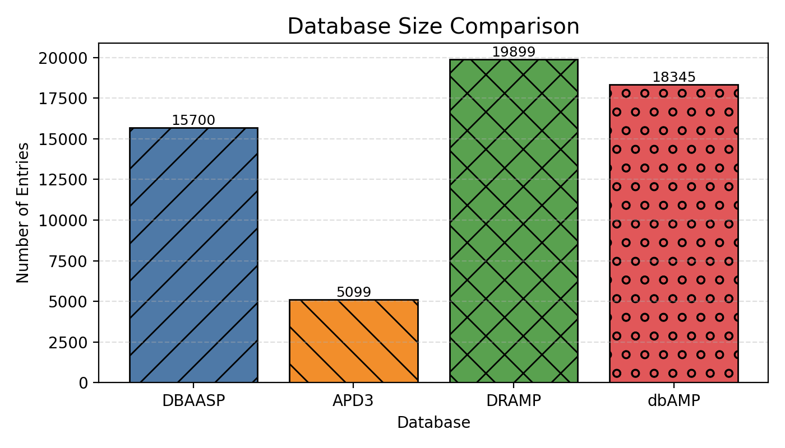
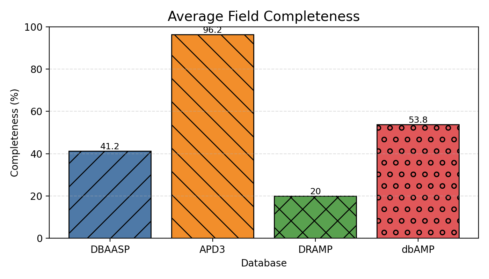
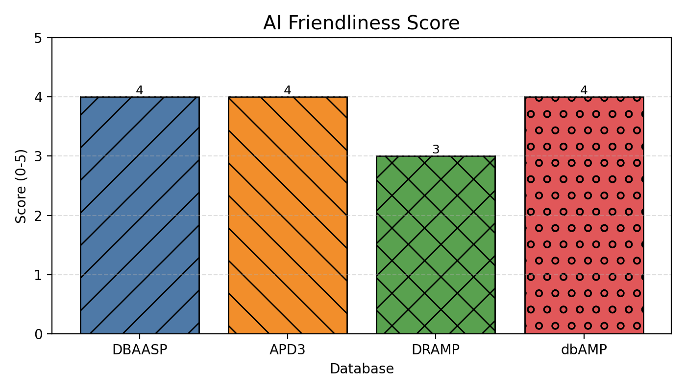

# 四个抗菌肽数据库横向对比报告

数据抓取日期：2025-09-12
参与数据库：DBAASP, APD3, DRAMP, dbAMP

## 1. 总体对比
- 指标：数据量、平均字段完整度%、近三年更新次数、最新版本号/日期、AI友好性评分
- 数据来源见附录 sources.json

**总览表**

**数据量对比**

**字段完整度对比**

**AI友好性评分**

**图例**

## 2. 字段覆盖矩阵
关键字段：序列、活性(MIC/靶标)、来源物种/类型、长度/理化性质、PTMs修饰、文献DOI/PMID、结构(PDB/预测)、毒性(溶血/细胞毒)

**字段覆盖表**

## 3. 数据格式与获取方式（补充）
- 是否支持：FASTA / CSV/TSV / JSON
- 是否提供API / 批量下载
- 许可协议（开放/研究/商用）
- 镜像/备份/DOI
请在 sources.json 中补充，并可另存表格 data/summary/access_methods.csv

## 4. 结论与建议
- **数据量与完整性**: DBAASP 和 dbAMP 在数据量上领先，而 APD3 在字段完整性方面表现出色。
- **AI友好性**: 具有更高AI友好性评分的数据库（例如，具有结构化输出和API的数据库）可以显着降低数据工程成本并提高研究的可重复性。
- **建议**: 为了进行全面的分析，建议合并来自多个数据库的数据。标准化数据格式和字段对于有效集成至关重要。

## 附录
- `sources.json`：各数据库版本号、更新时间、抓取链接与时间戳