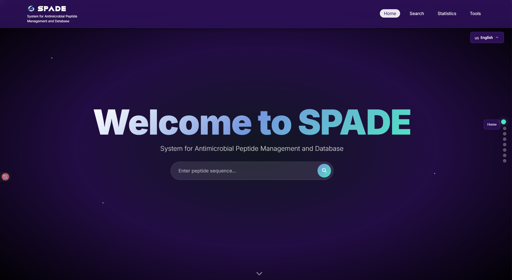

# SPADE: An Intelligent Software Platform for Antimicrobial Peptide Discovery

## 1. Project Vision and Motivation

SPADE serves researchers and industry R&D teams who need dependable antimicrobial peptide (AMP) data that can be queried quickly and applied directly in discovery workflows, bringing curated entries, clear structures and practical filters together so everyday questions can be answered without wrestling with format inconsistencies or scattered sources.

The index covers more than 46,000 peptides, cross‑referenced from PubMed and peer‑reviewed literature, and consolidated into a single schema that preserves provenance while standardizing key fields to support consistent queries.

Data quality is maintained through a streamlined yet rigorous pipeline that combines human judgment and automation: records are cross‑checked across sources and harmonized by manual curation when fields conflict, duplicates are removed by exact sequence and normalized name matching with additional near‑duplicate flags from edit‑distance checks, and each release undergoes stratified random sampling to verify correctness and relevance; we publish per‑release quality indicators—manual cross‑check counts, automated deduplication rate, and sampling coverage—together with the index so users can see how the dataset is maintained over time.

To match common usage habits, the website supports Chinese, English, Japanese, German and Spanish, and the search interface keeps interactions consistent with a left‑side panel for filters and a results table that updates immediately as conditions change; filters name the fields users care about—ID, name, sequence length, activity type and target organism, physicochemical attributes such as net charge and hydrophobicity, and predicted structural features—so typical queries can be expressed in one pass.

A typical combination might target antifungal activity against Candida albicans with net charge above +2 and a hydrophobicity range suited to membrane interaction, and the operational path keeps analysis close to the task by setting conditions on the Search page, reading the updated results table, and opening the peptide’s card to examine consolidated details in a single view.

## 2. A Guided Tour of the SPADE Platform

The website follows a workflow that aligns with how people actually use AMP data: you begin on the Home page to understand the modules and reach the key entry points, you set conditions on the Search page with a left‑side filter panel and watch the results table update as you refine queries, and you open a peptide’s card to read consolidated details in one place so the transition from overview to inspection does not interrupt the task.

The Home page introduces the platform and provides direct navigation to Search, Peptide Card, AMP Visualization, Tools and Statistics; images on this page are placeholders that will be replaced later.

The Search page implements multi‑dimensional filtering over a curated index of more than 46,000 peptides, with fields that match common habits—ID, name, sequence length, activity type and target organism, physicochemical attributes such as net charge and hydrophobicity, and predicted structural features—so typical queries can be expressed in one pass and the table of results remains the primary data display for scanning and selection.

The Peptide Card presents a single peptide in a structured view that brings together sequence, derived properties, measured activities, predicted structure, and literature references; the card is designed as the second data display page in the workflow, and clicking from the results table to the card keeps context while shifting from list‑level screening to item‑level verification.

AMP Visualization focuses on scoring views that aid interpretation, exposing plots such as hydrophobicity profiles and simple 2D structure predictions alongside score‑based summaries of how a peptide aligns with desired properties. Score composition is transparent: efficacy, stability, synthesis and toxicity contribute at weighted proportions, with sub‑weights covering MIC with a synergy bonus, half‑life, pH/thermal stability, protease sensitivity, disulfide count, sequence length and rare amino acids, and toxicity indicators such as Boman score, cytotoxicity and hemolysis. Range parameters—GRAVY optimal −0.2 to 0.1, maximum sequence length 30, minimum hydrophobicity 0.4, optimal disulfide count 4—follow the configuration in program/weights_config.yaml. Visuals can be opened from the card to keep analysis contiguous.

The Tools page links to internal scripts and selected external utilities for alignment, structure prediction and toxicity analysis, and the Statistics page offers interactive charts that summarize global distributions—sequence lengths, activity types and target organisms—so dataset shape can be reviewed before or after focused filtering.

## 3. Design Philosophy and Architectural Overview

The frontend is a static site (HTML/CSS/vanilla JS). For specific processing tasks, we use a lightweight Flask backend. This keeps the UI fast and portable, suitable for simple hosting or CDNs.

For search, SPADE relies on a pre-compiled JSON index (peptide_index.json) instead of a relational database.
- Rationale: fewer dependencies, simpler deployment, and high portability; suitable for labs without dedicated IT support.
- Trade-off: database engines offer richer queries but add complexity. For filter-based discovery, a single JSON object with efficient client-side filtering is sufficient.

Pages are modular and loosely coupled. New features can be added by introducing a dedicated page and wiring it into navigation without disturbing existing modules.

Advanced components (e.g., RAG + Neon database) are provided on an as-needed schedule due to resource demands. To control misuse and cost, continuous public access is not offered.

## 4. User Guide: Getting Started with SPADE

Step 1: Multi-Dimensional Search
1) Open the Search page from the main navigation.
2) Use the left-side filter panel (Basic, Activity, Structure) to set conditions—for example: Antifungal activity targeting Candida albicans, net charge > +2.
3) Results update in real time on the right. Refine conditions iteratively.

Step 2: Analyze a Specific Peptide
1) Locate a peptide of interest in the results.
2) Click “View” in the Action column to open its Peptide Card.
3) Review sequence, properties, activities, structure, and source references.

Step 3: Visual Inspection
1) Click “Visualize” to open plots such as hydrophobicity and 2D structural predictions.
2) Use these visuals to corroborate and interpret results.

